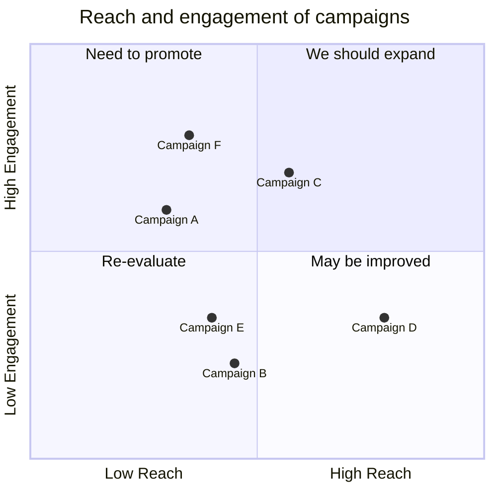
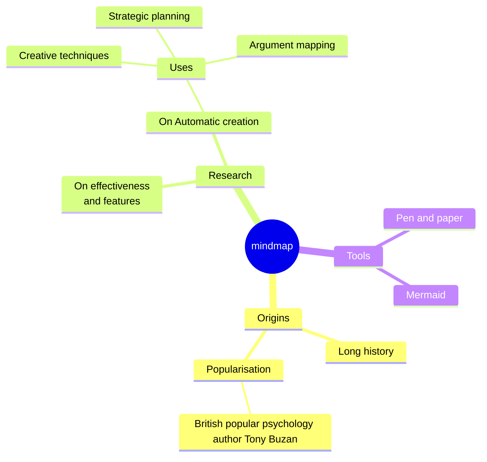

---
postId: 000
filename: "000_template.md"
layout: "post"
title: "Template | Markdown Style Guide"
cover: "/assets/development/cover.png"
slug: "template-markdown"
chips:
  - label: "2023-12-17"
    icon: "pi pi-calendar"
  - label: "20 min"
    icon: "pi pi-clock"
authors:
  - id: 0
    name: "nonodev96"
    image: "/assets/development/avatar.png"
categories:
  - Markdown
  - Latex
keywords:
  - Markdown
  - Latex
summary: "Aprende a estructurar documentos utilizando sintaxis sencilla de Markdown para crear títulos, listas, enlaces e imágenes. También se cubriría cómo personalizar el estilo y diseño del documento utilizando extensiones y características avanzadas de Markdown, como tablas y bloques de código."
---

# Guía de markdown

Aprende a estructurar documentos utilizando sintaxis sencilla de Markdown para crear títulos, listas, enlaces e imágenes. También se cubriría cómo personalizar el estilo y diseño del documento utilizando extensiones y características avanzadas de Markdown, como tablas y bloques de código.

### Títulos

```àscii

# Títulos 1

## Título 2

### Título 3

```

---

### Texto con enfasís y en negrita

Formato: `_énfasis_`, `**negrita**`

Texto normal con _énfasis_ y **negrita**.

### Lista no ordenada:

Formato:

```ascii
- Elemento 1
- Elemento 2
- Elemento 3
```

- Elemento 1
- Elemento 2
- Elemento 3

### Lista ordenada:

Formato:

```àscii
1. Primer elemento
2. Segundo elemento
3. Tercer elemento
```

1. Primer elemento
2. Segundo elemento
3. Tercer elemento

---

### Enlaces

```ascii
[Enlace a Google](https://www.google.com)
```

[Enlace a Google](https://www.google.com)

---

### Imágenes

Formato:

```ascii

```


---

### Imágenes por referencia

Formato:  

```ascii
![alt text][logo-1]
![alt text][logo-2]

[logo-1]: /favicon.ico "Logo Title Text 2"
[logo-2]: /favicon.ico "Logo Title Text 2"
```

![alt text][logo-1]

[logo-1]: /favicon.ico "Logo Title Text 2"

---

### Bloque de código:

````ascii
```python
print("Hola, mundo!")
```
````

```python
print("Hola, mundo!")
```

---

### Citas:

Formato: `> TEXTO`

> Esto es una cita.

---

### Línea horizontal

Formato: `---`

---

### Tablas

Formato:

```ascii
| Encabezado | Alineado a la izquierda | Alineado a la derecha | Alineado centrado |
| ---------- | :---------------------- | --------------------: | :---------------: |
| Celda 1,1  | Celda 1,1               |             Celda 1,2 |     Celda 1,2     |
| Celda 2,1  | Celda 2,1               |             Celda 2,2 |     Celda 2,2     |
```

| Encabezado | Alineado a la izquierda | Alineado a la derecha | Alineado centrado |
| ---------- | :---------------------- | --------------------: | :---------------: |
| Celda 1,1  | Celda 1,1               |             Celda 1,2 |     Celda 1,2     |
| Celda 2,1  | Celda 2,1               |             Celda 2,2 |     Celda 2,2     |

---

### Checkbox

Formato:

```ascii
- [x] Tarea completada
- [ ] Tarea pendiente
```

- [x] Tarea completada
- [ ] Tarea pendiente

---

### Emoji:

Formato: `:emoji-key:`

Esto es un emoji :heart:

---

### Latex

Latex en línea:

Formato: `$ LATEX EQUATION $`

```latex
$ f(x) = \int_{-\infty}^\infty \hat f(\xi) e^{2 \pi i \xi x} d\xi $
```

$ f(x) = \int\_{-\infty}^\infty \hat f(\xi) e^{2 \pi i \xi x} d\xi $

Latex en bloque:

Formato: `$$ LATEX EQUATION $$`

```latex
$$ f(x) = \int_{-\infty}^\infty \hat f(\xi) e^{2 \pi i \xi x} d\xi $$
```

$$ f(x) = \int\_{-\infty}^\infty \hat f(\xi) e^{2 \pi i \xi x} d\xi $$

## Mermaid:





