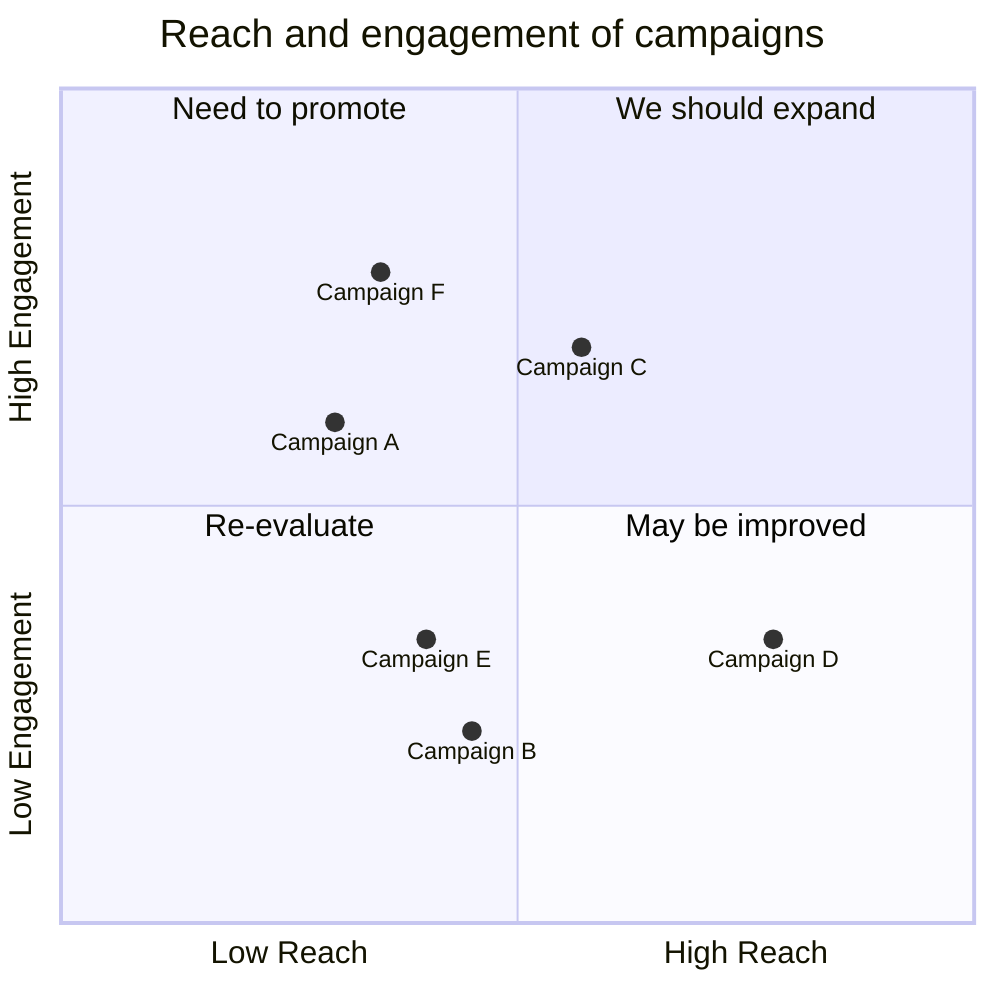
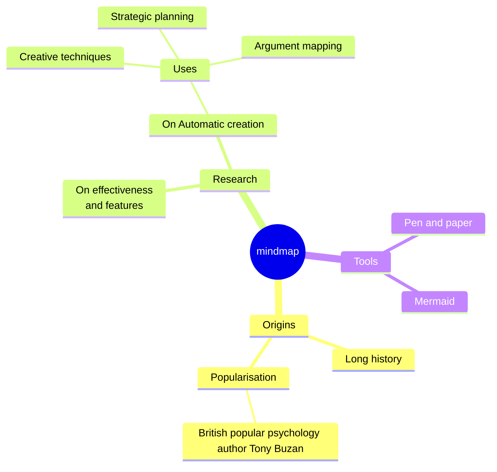

---
layout: "post"
title: "Promise in JS"
cover: "/assets/development/cover.png"
chips:
  - label: "2023-12-17"
    icon: "pi pi-calendar"
  - label: "1 hour"
    icon: "pi pi-clock"
authors:
  - name: "nonodev96"
    image: "/assets/development/avatar.png"
summary: "Text summary"
---

# Título 1

## Título 2

### Título 3


Texto normal con *énfasis* y **negrita**.

Lista no ordenada:
- Elemento 1
- Elemento 2
- Elemento 3

Lista ordenada:
1. Primer elemento
2. Segundo elemento
3. Tercer elemento

Enlaces:
[Enlace a Google](https://www.google.com)

Imágenes:

Inline-style:


Reference-style:
![alt text][logo]

[logo]: /favicon.ico "Logo Title Text 2"

Bloque de código:
```python
print("Hola, mundo!")

```

Citas:
> Esto es una cita.

Línea horizontal:
---

Tablas:
| Encabezado 1 | Encabezado 2 |
| ------------ | ------------ |
| Celda 1,1    | Celda 1,2    |
| Celda 2,1    | Celda 2,2    |

Checkbox:
- [x] Tarea completada
- [ ] Tarea pendiente

Emoji:

Esto es un emoji :heart:

Latex:
```latex
f(x) = \int_{-\infty}^\infty \hat f(\xi) e^{2 \pi i \xi x} d\xi
```

$f(x) = \int_{-\infty}^\infty \hat f(\xi) e^{2 \pi i \xi x} d\xi$

Mermaid:







